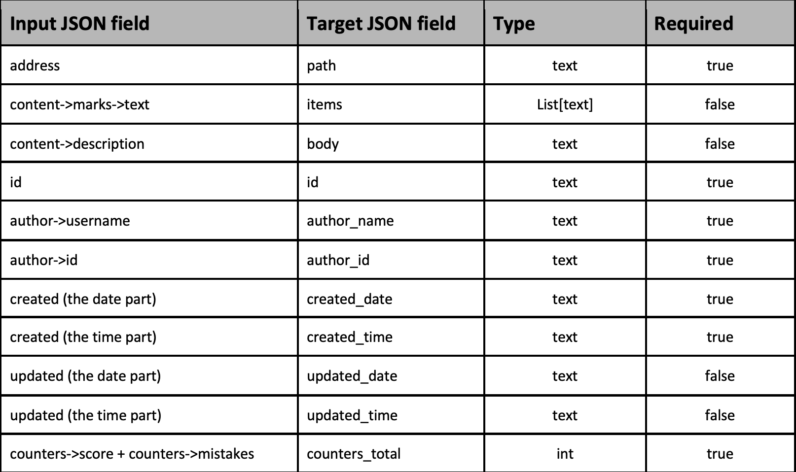

# Test application

## Task definition

Retriever
Python test assignment
Write a Python code that takes a JSON string as an input, transforms it into another JSON format, and saves the result as a JSON field in a Postgres DB.

#### Example JSON input
````json
{
  "address": "https://www.google.com ",
  "content": {
    "marks": [
      {
        "text": "marks"
      },
      {
        "text": "season"
      },
      {
        "text": "foo"
      },
      {
        "text": "bar"
      }
    ],
    "description": "Some description"
  },
  "updated": "2021-02-26T08:21:20+00:00",
  "author": {
    "username": "Bob",
    "id": "68712648721648271"
  },
  "id": "543435435",
  "created": "2021-02-25T16:25:21+00:00",
  "counters": {
    "score": 3,
    "mistakes": 0
  },
  "type": "main"
}
````

#### The mapping table for converting the input JSON into the target JSON



#### The expected deliverables
    
 - The Python code with the instructions on how to run it

#### What we will evaluate

 - Code organization (OOP-style is preferrable)
 - The test coverage
 
 
 ___
 
 ## How to Run!
 
 -  Install python. Project developed with python 3.8.
 -  Install python requirements.
     
    
    pip install -r requirements.txt
    
 -  Run database! Set own Database credentials to variables.env file 
    or you can use prepared docker-compose file and default credentials.
    This configuration includes database volume(You can remove volume if not have to...)
    ___
    Install docker instructions: https://docs.docker.com/engine/install/
    ___
    Install docker-compose instructions: https://docs.docker.com/compose/install/
    ___
    Docker-compose running command:
    ___
    
    
    docker-compose up -d
 
 -  Application works with input files. 
    One object or objects list can be inside.
    Examples:
 
 
    python app.py --file input.json
    python app.py --file input_list.json


## Project structure
````
.
|-- README.md
|-- app.py - main file for running.
|-- config.py - Settings file.
|-- docker-compose.yml - Docker-compose config for local database running.
|-- docs - Docs exctensions folder
|   `-- images
|       `-- type_table.png
|-- input.json - Input file with one object for testing.
|-- input_list.json - Input file with list of objects for testing.
|-- requirements.txt - Project python dependencies.
|-- src - Custom packages.
|   |-- __init__.py
|   |-- database
|   |   |-- __init__.py
|   |   |-- abstract.py - Database abstract classes.
|   |   `-- postgres.py - Database Postgres classes.
|   |-- exceptions.py - Project Exceptions.
|   |-- lib.py - Utils.
|   |-- models - Database tables.
|   |   |-- __init__.py
|   |   `-- my_json_table.py - Target table for test task.
|   `-- serializers
|       |-- __init__.py
|       `-- input.py - Serializer for input data.
|-- tests 
|   |-- __init__.py
|   |-- datasets - Datasets for testing.
|   |   `-- correct_input.json
|   `-- serialization.py - Test for correct serialization.
`-- variables.env
````

